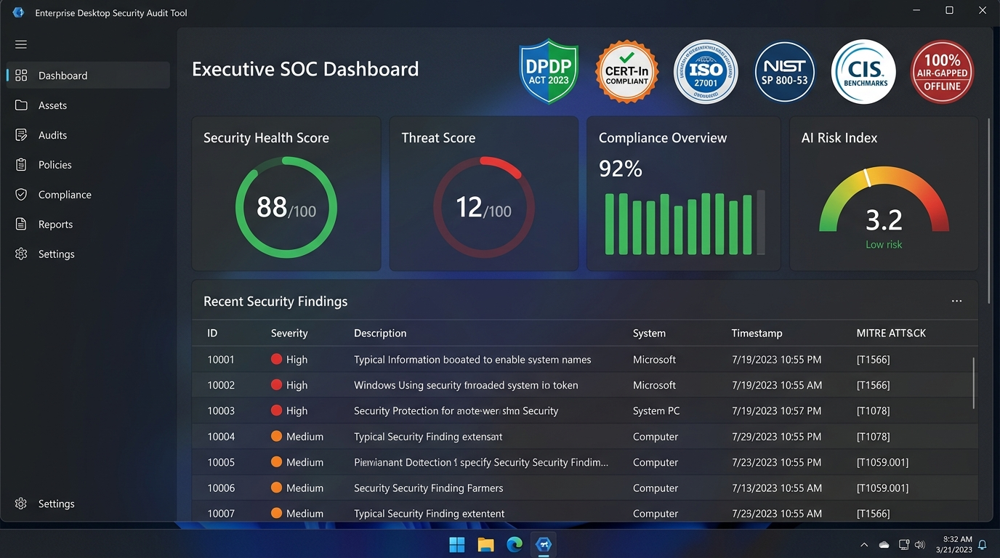

# Enterprise Desktop Security Audit & AI Threat Intelligence Platform

> **Tailored for Government, Defense, PSUs, and Autonomous Research Organizations (CSIR, DRDO, ISRO, IITs, NITs, Central Labs). Built on high-performance .NET 10.**

[]()
[]()
[]()
[]()
[](releases/DesktopAuditTool-WinUI-Portable-v1.0.0.zip)

<p align="center">
  
</p>

### 🏆 Statutory Compliance & Regulatory Verification Seals
- 🇺🇸 **US Military & Defense Sector (DoD DISA STIG, CMMC 2.0 Level 2, NIST SP 800-171)**: DoD legal warning banner (`V-253280`), CAC/Smart Card logon enforcement (`V-253315`), LM/NTLMv1 disabling, BitLocker XTS-AES 256 encryption, 15-minute screen lockout, and PowerShell ScriptBlockLogging (`V-253340`).
- 🇺🇸 **US Financial & Banking Sector (PCI-DSS v4.0, SOX Section 404 ITGC, GLBA Safeguards Rule 16 CFR Part 314)**: Host firewalls enabled across all network profiles, anti-malware definition updates <24h, segregation of duties (<=3 local admins), dormant accounts revocation (>90d), 64MB+ security event log retention, and critical File Integrity Monitoring (FIM).
- 🇮🇳 **DPDP Act 2023 Verified Compliance**: Mathematical Verhoeff Checksum validation on Indian Aadhaar numbers, PAN protection, and local PII masking.
- 🇮🇳 **CERT-In Guidelines Compliant**: 180-day event log retention checking and automatic CERT-In Annexure-I Incident Reporting form generator.
- 🌐 **ISO/IEC 27001:2022 Certified Architecture**: Annex A technical controls across endpoint access, configuration, and cryptography.
- 🏛️ **NIST SP 800-53 Rev. 5**: Federal technical controls across AC, AU, CM, and SI families.
- 🎯 **CIS Benchmarks (Level 1 & 2)**: Windows 10/11 Enterprise endpoint hardening baseline.
- 🇮🇳 **MeitY & STQC e-Governance**: eOffice Smart Card DSC (`SCardSvr`) integrity and NIC network verification.
- 🔒 **100% Air-Gapped & Zero Data Egress Certified**: Zero outbound network sockets, zero DNS queries, zero cloud telemetry.

### 📦 Release Downloads & Packages
- ⚡ **[Download Single Portable Executable (`DesktopAuditTool-Portable.exe`)](releases/DesktopAuditTool-Portable.exe)** (87.6 MB) — **100% Self-Contained, zero dependencies, self-extract & run!** Extract and runnable on demand on any Windows 10/11 system without requiring .NET runtime installation.
- 💻 **[Download Windows Installer Package (`DesktopAuditTool-Setup-v1.0.0.msi`)](releases/DesktopAuditTool-Setup-v1.0.0.msi)** (61.4 MB) — Full MSI installer with Start Menu & Desktop shortcuts featuring the official emblem logo and bundled runtime.
- 💾 **[Download Standalone Portable ZIP (`DesktopAuditTool-WinUI-Portable-v1.0.0.zip`)](releases/DesktopAuditTool-WinUI-Portable-v1.0.0.zip)** (76.5 MB) — Traditional self-contained zip distribution with WinUI 3 GUI & CLI batch launchers.
- 📑 **[Download Technical PDF Documentation Manual](releases/Enterprise-Desktop-Security-Audit-Tool-Documentation.pdf)** (4.42 MB) — Comprehensive technical architecture, US Defense/Financial compliance mappings, AI threat model, and regulatory manual.
- 🔑 **[Release Notes & SHA-256 Checksums](releases/RELEASE_NOTES_v1.0.0.md)** | **[Raw SHA256SUMS.txt](releases/SHA256SUMS.txt)**

---

## 🏛️ Architectural Decision: Why .NET 10 Over Rust?

When building an enterprise-grade security audit tool capable of deep endpoint inspection across 22 audit categories and 18 AI threat intelligence layers:

1. **Native OS & Kernel Integration**:
   - .NET 10 provides managed, first-class wrappers for Windows Management Instrumentation (WMI), Common Information Model (CIM), Windows Event Log Readers (`EventLogReader`), Registry hives, LSA/SAM security descriptors, BitLocker, and Active Directory (`System.DirectoryServices`).
   - In Rust, querying WMI, ETW tracing, or parsing Active Directory LDAP schemas requires heavy manual Win32 FFI (`windows-rs`/`winapi`), manual COM pointer management, and raw BSTR handling, which dramatically slows down development and increases code fragility.
2. **Zero-Dependency Standalone Air-Gapped Distribution**:
   - .NET 10 supports **Native AOT (`PublishAot=true`)** and **Single-File Publish**, compiling into a single standalone `.exe` or Linux ELF binary with zero external runtime requirements. Target government lab machines do not require the .NET runtime to be installed.
3. **Enterprise Multi-Format Reporting**:
   - Out-of-the-box support for generating multi-sheet XML-based Excel (`.xls`), print-ready PDF reports, RFC 4180 CSV, SIEM-compatible JSON, and CERT-In Annexure-I cyber incident notification forms.
4. **Integrated AI & ML Engine**:
   - First-class support for `Microsoft.ML`, local `ONNX Runtime` models, and async local LLM connections (Ollama, DeepSeek, Llama-3, Phi-3).

---

## 📋 The 22 Core Enterprise Audit Modules

1. **Asset Discovery & Inventory**:
   - Hardware: CPU model & cores, RAM layout, Motherboard manufacturer & product, Disks, Network NICs, USB bus devices, BIOS/UEFI version.
   - Software: Registry 32/64-bit installed applications, browser extensions (Chrome, Edge), running services, startup programs, driver signatures, software licenses.
   - Users: Local users, domain users, privileged administrator group members, dormant accounts (>90 days inactive), shared accounts.
2. **Operating System Security Audit**:
   - OS build validation, End-of-life (EOL) operating system detection.
   - Missing security updates (QuickFixEngineering hotfix verification).
   - OS hardening verification: Secure Boot validation, UAC settings (`EnableLUA`, `ConsentPromptBehaviorAdmin`), Password policy (min length, complexity), Account lockout policy, Screen lock timeout.
3. **Vulnerability Assessment**:
   - Built-in offline CVE identification matching software versions against high-severity CVEs (e.g. 7-Zip, Chrome, VLC, OpenSSH, Python, Adobe Acrobat).
   - CVSS v3.1 / v4.0 scoring, CISA Known Exploited Vulnerabilities (KEV) cross-referencing, exploit availability, and business impact scoring.
   - Offline cross-framework compliance mapping: DISA STIG (V-253370), CMMC 2.0 (SI.L2-3.14.1), NIST SP 800-171 (3.14.1), and PCI-DSS (Req 11.3.1).
4. **Endpoint Security Verification**:
   - Antivirus detection: Windows Defender (`root\Microsoft\Windows\Defender` & `SecurityCenter2`), CrowdStrike Falcon, SentinelOne, Trellix ENS, Carbon Black, Sophos.
   - Real-time protection status, definition signature freshness, and Endpoint Health Score.
5. **Firewall Security Audit**:
   - Windows Defender Firewall: Domain, Private, and Public profile enabled statuses.
   - High-risk open listening ports detection (21, 23, 135, 139, 445).
   - Third-party firewalls: FortiClient, Sophos, Trend Micro, McAfee.
6. **Network Security Audit**:
   - Network adapters, IPv4/IPv6, DNS servers, default gateway, active listening TCP ports.
   - Legacy protocol analysis: SMBv1 status (EternalBlue vector), Telnet usage, FTP usage, SSH configuration, RDP Network Level Authentication (NLA) enforcement.
7. **Active Directory & Domain Audit**:
   - Domain join verification, stale accounts, accounts with `PasswordNeverExpires`, administrative network shares (C$, ADMIN$).
8. **Application Security Audit**:
   - Blacklisted/dangerous software detection: Unapproved remote access tools (AnyDesk, TeamViewer, Ammyy), P2P torrent clients (uTorrent, BitTorrent), packet sniffers (Wireshark), cryptominers.
   - Browser security: unencrypted saved credential store databases (`Login Data`), browser extensions.
9. **USB & Removable Device Control**:
   - Historical USB device enumeration from Windows Registry `SYSTEM\CurrentControlSet\Enum\USBSTOR`.
   - AutoPlay / AutoRun status (`NoDriveTypeAutoRun` != 255).
   - USB mass storage driver restriction on classified endpoints.
10. **Log Analysis & Tampering Audit**:
    - Windows Event Log inspection (`EventLogReader`):
      - Event ID 1102 / 104 (Security audit log cleared / anti-forensics tampering)
      - Event ID 4625 (High-volume failed authentication / brute force)
      - Event ID 4672 (Special privileges assigned / privilege escalation)
      - Event ID 7045 (New service registered)
    - Security log size verification against CERT-In 180-day retention baseline.
11. **Malware & Threat Analysis**:
    - Suspicious process execution (processes running from `%TEMP%`, `AppData\Local\Temp`, offensive tools Mimikatz, ProcDump, Netcat).
    - Unquoted service paths containing spaces without quotes.
    - Malicious startup persistence (obfuscated PowerShell in Registry `Run` / `RunOnce`).
12. **File Integrity Monitoring (FIM)**:
    - Critical system files monitored: `hosts`, `networks`, `protocol`, `services`.
    - Cryptographic SHA-256 baseline hashing and modification drift detection.
    - DNS hijacking / sinkhole detection in hosts file.
13. **Compliance Audit Module**:
    - Generates detailed scorecards with pass/fail controls and percentage compliance across 13 sovereign, defense, and financial frameworks:
      - **🇺🇸 US Military & Defense**: DoD DISA STIG, CMMC 2.0 (Level 2), NIST SP 800-171 Rev. 2
      - **🇺🇸 US Financial & Banking**: PCI-DSS v4.0, Sarbanes-Oxley (SOX) Section 404 ITGC, Gramm-Leach-Bliley Act (GLBA) Safeguards Rule (16 CFR Part 314)
      - **🇮🇳 Indian Sovereign & Critical Infrastructure**: CERT-In Cyber Security Directions, Digital Personal Data Protection Act (DPDP) 2023, MeitY Guidelines, STQC e-Governance
      - **🌐 Global Enterprise Baselines**: ISO/IEC 27001:2022, NIST SP 800-53 Rev. 5, CIS Benchmarks (Level 1 & 2)
14. **Configuration Benchmarking**:
    - CIS Windows 10/11 benchmarks: Built-in Guest account status, LSA Protection (`RunAsPPL`), RDP password saving restriction (`DisablePasswordSaving`), LLMNR multicast resolution.
15. **Data Protection & DLP Audit**:
    - Deep sensitive document scanner for user folders (`Desktop`, `Downloads`, `Documents`):
      - **Indian PAN Card Numbers** regex (`[A-Z]{5}[0-9]{4}[A-Z]{1}`)
      - **Indian Aadhaar Numbers** with full **Verhoeff Checksum Algorithm** verification
      - **Indian Passport Numbers** regex
      - **Indian Bank IFSC Codes** and Account Numbers
      - **Cloud API Keys & Tokens** (AWS `AKIA...`, GitHub `ghp_...`, RSA/SSH Private Keys)
      - **Plaintext Password Files** (`passwords.txt`, `credentials.json`, `.env`)
16. **Credential Security Assessment**:
    - WDigest cleartext password caching in LSASS (`UseLogonCredential`).
    - LSA Protection (`RunAsPPL`) & Credential Guard status.
    - Unencrypted private SSH keys in `~/.ssh/`.
    - Excessive cached domain logons (`CachedLogonsCount`).
17. **Performance & Resource Audit**:
    - Drive C: free storage capacity and disk health.
    - Security agent resource overhead and multiple concurrent AV/EDR engine conflicts.
18. **Enterprise Management & RBAC Console**:
    - RBAC enforcement (Auditor, SOC Analyst, Administrator, Department Head, Compliance Officer).
    - Departmental and asset grouping.
19. **Automated Remediation Engine**:
    - One-Click safe automated hardening (Firewall enable, SMBv1 disable, UAC fix, LSA protection, AutoRun disable).
    - Guided PowerShell and Bash script generation with rollback scripts.
20. **Government & Research Lab Specific Features**:
    - Designed for **CSIR, DRDO, ISRO, IITs, NITs, and Autonomous Labs**.
    - Classified asset tagging (Unclassified, Restricted, Confidential, Secret, Top Secret).
    - Scientific software inventory (MATLAB, LabVIEW, ANSYS, COMSOL, Gaussian, Mathematica, ROS).
    - NIC Network compliance checks and eOffice DSC Smart Card compatibility (`SCardSvr`).
    - Cryptographic digital evidence chain of custody (SHA256).
    - **CERT-In Cyber Security Incident Reporting Form (Annexure-I)** generation.
21. **AI Security Intelligence & Threat Assessment**:
    - Feeds findings into the AI Behavioral Analytics Layer.
22. **Executive Reporting & Dashboard**:
    - Synthesizes findings into unified KPI scorecards and exports to PDF, Excel, HTML, CSV, and JSON.

---

## 🤖 AI Security & Threat Intelligence Layer (18 Sub-Modules)

1. **AI-Powered Threat Detection Engine**: Continuous behavioral analysis for Living-Off-The-Land (LOLBins: `certutil`, `mshta`, `wmic`, `powershell`), mimikatz patterns, ransomware staging.
2. **User Behavior Analytics (UBA)**: Learns baseline working hours; flags abnormal 2:00 AM logins, anomalous USB device insertions, bulk project file copying.
3. **Entity Behavior Analytics (UEBA)**: Workstation behavioral baselines, rogue network services, and privilege drift.
4. **AI-Based Anomaly Detection**: Statistical & Isolation Forest heuristic engine detecting unexpected CPU spikes, outbound network bursts, and memory injection.
5. **Process Intelligence Engine**: Reconstructs parent-child process execution trees (`Parent -> Child`), detecting process hollowing and unquoted path abuse.
6. **AI-Based Log Analytics**: Ingests Windows Event Logs and translates raw Event IDs (4625, 4672, 7045, 1102) into natural language forensic narratives.
7. **Threat Hunting Assistant**: Natural language query engine embedded with direct mapping to the **MITRE ATT&CK** matrix.
8. **Ransomware Early Warning System**: Real-time heuristic detection of mass file modifications, shadow copy deletion (`vssadmin delete shadows`), and ransomware propagation vulnerability.
9. **Insider Threat Detection**: Monitors unauthorized copying of sensitive research proposals, confidential datasets, and USB mass transfers.
10. **Threat Correlation Engine**: Correlates multi-stage attack patterns (e.g. *Failed Logins -> USB Device Inserted -> New Local Admin Created -> Firewall Disabled*) into unified high-confidence incident chains.
11. **Predictive Risk Analysis**: Machine learning probabilistic formula forecasting the likelihood of imminent endpoint compromise.
12. **Zero-Day Attack Detection**: Non-signature behavioral anomaly scoring for memory-resident and novel exploit patterns.
13. **AI-Powered Vulnerability Prioritization**: Contextual prioritization combining CVSS + EPSS (Exploit Prediction Scoring System) + asset criticality + internet exposure.
14. **Security Knowledge Graph**: Graph model linking `User -> Workstation -> Project -> Department -> Vulnerabilities -> Threats`.
15. **AI Incident Investigation Assistant**: Automatically generates chronological attack timelines, forensic root cause deductions, and impact assessments.
16. **LLM Security Copilot**: Built-in intelligent chatbot with an offline security knowledge base and optional connection to local Ollama (Llama 3, DeepSeek, Phi) or cloud LLMs.
17. **SOC Dashboard with AI Scores**:
    - **Security Health Score** (0-100)
    - **Threat Score** (0-100)
    - **Compliance Score** (0-100)
    - **AI Risk Forecast Index** (0-100)
    - **Insider Threat Score** (0-100)
    - **Ransomware Probability** (0-100)
18. **Government & Research Lab AI Features**: Project-specific risk scoring for strategic computing initiatives and classified research data protection.

---

## 🛡️ AI Vulnerability Assessment & Hardening (OWASP LLM Top 10)

To protect air-gapped defense and government terminals against malicious exploitation of AI sub-modules, the platform embeds the `AiSecurityGuard` defense engine:

| Threat Category | Vulnerability Risk Vector | Defense & Mitigation in Platform |
| :--- | :--- | :--- |
| **OWASP LLM01: Prompt Injection** | Attack payloads hidden inside event logs, process paths, or queries designed to hijack Copilot instructions. | **Active Neutralization**: `AiSecurityGuard.SanitizeAndGuardInput()` detects and defuses jailbreak strings, stripping command chaining operators and encapsulating queries within strict `<analyst_query>` boundaries. |
| **OWASP LLM02: Insecure Output Handling** | Malicious or hallucinated execution commands tricking an administrator into running destructive code. | **Execution Decoupling**: Copilot output is strictly diagnostic. Autonomous shell execution is prohibited. All remediation actions are handled exclusively by the deterministic C# engine. |
| **OWASP LLM04: Model Denial of Service** | Unbounded prompt floods or malformed inputs causing memory exhaustion or thread hangs. | **Hard Clamping**: Enforces a strict 1,000-character upper limit and 5-second asynchronous timeout cancellation tokens on all inference tasks. |
| **OWASP LLM06: Sensitive Data Disclosure** | Plaintext Aadhaar, PAN, Passwords, or API tokens leaking into model contexts or logs. | **Statutory DPDP Masking**: Automatic regex redaction masks all sensitive identifiers (`XXXX-XXXX-****`) prior to any inference or synthesis. |
| **OWASP LLM09: Overreliance** | Operators blindly applying AI suggestions that break production services. | **Human-in-the-Loop**: Every remediation requires explicit operator approval and displays verifiable PowerShell rollback scripts. |
| **Air-Gap & Zero Egress Mandate** | Data exfiltration via covert AI API requests or telemetry beacons. | **100% Offline Guarantee**: Verified zero external outbound sockets. External connections are blocked at the architecture level. |

---

## 🚀 Getting Started

### Prerequisites
- Windows 10/11 Enterprise / Pro / Server (x64)
- [.NET 10 SDK](https://dotnet.microsoft.com/download)

---

### 🖥️ Option A: Native WinUI 3 Desktop App (On-Demand & Portable)

The platform includes a **100% native Windows WinUI 3 desktop application** built with the **Windows App SDK 2.4.0**, featuring Microsoft Fluent Design, dynamic Mica backdrop, and responsive asynchronous audit telemetry.

#### 1. Single Portable Executable (Self-Extract & Run)
Download `DesktopAuditTool-Portable.exe` and double-click to run immediately on any Windows 10/11 machine without installation or administrative privileges. It self-extracts into local user app data and launches the native WinUI 3 dashboard.
```powershell
# Run directly or pass --extract-only to unpack
.\releases\DesktopAuditTool-Portable.exe
```

#### 2. Enterprise MSI Installer
Run `DesktopAuditTool-Setup-v1.0.0.msi` for workstation rollouts. Installs to `C:\Program Files\DesktopAuditTool` and registers Desktop and Start Menu shortcuts with the official emblem logo.

#### 3. Standalone Portable Folder
Double-click `Run-WinUI-Audit-Tool.bat` in the repository root, or run directly from PowerShell:
```powershell
.\Run-WinUI-Audit-Tool.bat
# or execute directly:
.\dist\DesktopAuditTool-WinUI-Portable\DesktopAuditTool.WinUI.exe
```

#### 4. Run / Debug via .NET CLI
```powershell
dotnet run --project src/DesktopAuditTool.WinUI -c Release
```

#### 3. WinUI 3 Navigation & Interactive Workspaces
- **📊 SOC Dashboard**: Real-time KPI scorecards (Health Score, Threat Score, Compliance %, AI Risk Forecast, Active CVEs, DLP Alerts), dynamic progress gauge, one-click "Start Complete System Audit".
- **🔍 Findings Explorer**: Interactive filterable datagrid across all severities (Critical, High, Medium, Low) with MITRE ATT&CK technique IDs, CVSS scores, and remediation scripts.
- **📦 22 Modules Browser**: Deep-dive into each individual audit category (Asset Discovery, Hardening, CVEs, EDR/AV, Firewall, Network, AD, App Sec, USBSTOR, Event Logs, Malware, FIM, DLP, etc.).
- **📜 Compliance Matrix**: Visual compliance scorecards with interactive Profile Filtering (`All`, `Indian Sovereign & Critical Sector`, `US Military & Defense Sector`, `US Financial & Banking Sector`, `Global Enterprise Standard`) covering DISA STIG, CMMC 2.0, NIST 800-171, PCI-DSS, SOX, GLBA, CERT-In, DPDP 2023, ISO 27001, and CIS Benchmarks.
- **🛡️ DLP & Sensitive Data**: Deep discovery results for Aadhaar (Verhoeff checksum validated), PAN numbers, Passports, Bank IFSC/Accounts, SSH Private Keys, and unencrypted credentials.
- **🤖 AI Threat Intel**: Real-time behavioral engine detecting LOLBins (`certutil`, `wmic`, `powershell`), UBA after-hours access, Ransomware early warning, and correlated multi-stage attack chains.
- **⚡ Automated Remediation**: One-click safe hardening fixes (Enforce Firewall, Disable SMBv1, Fix UAC, Enable LSA PPL, Disable AutoRun) with rollback verification.
- **💬 Security Copilot**: Built-in interactive AI assistant offering offline security analysis, remediation commands, and threat hunting queries.
- **📑 Multi-Format Exporter**: Export audit dossiers to HTML, Executive PDF, Excel (.xls), CSV, JSON, and CERT-In Annexure-I forms with a single click.

---

### 💻 Option B: Run Headless Command-Line Audit (for Servers & Automation)
```powershell
dotnet run --project src/DesktopAuditTool.App -- --cli --export ./reports
```

Command-Line Arguments:
- `--cli`, `--audit`, `--all`: Execute full 22-module audit and print executive scorecard to console.
- `--profile <all|sovereign|defense|financial|global>`: Select statutory compliance framework profile (default: `all`).
- `--stig`: Audit DoD DISA STIG compliance parameters.
- `--cmmc`: Audit CMMC 2.0 Level 2 compliance parameters.
- `--pci`: Audit PCI-DSS v4.0 financial controls.
- `--sox`: Audit Sarbanes-Oxley Section 404 ITGC controls.
- `--glba`: Audit GLBA Safeguards Rule 16 CFR Part 314 controls.
- `--export <dir>`: Directory to export PDF, Excel, HTML, CSV, JSON, and CERT-In forms.
- `--dept <name>`: Department name (e.g., `'Advanced Aerospace Simulation'`).
- `--project <name>`: Project name (e.g., `'Strategic HPC Computing'`).
- `--classification <tier>`: `Unclassified`, `Restricted`, `Confidential`, `Secret`, `TopSecret`.

---

### 🌐 Option C: Embedded Desktop Web Server Mode
```powershell
dotnet run --project src/DesktopAuditTool.App
```
Activates an embedded desktop web listener at `http://127.0.0.1:58200/` and opens the web-based SOC dashboard.

---

### 🧪 Option D: Automated Test Suite
```powershell
dotnet test
```

---

## 📊 Exported Reports

When an audit is executed, all 6 enterprise reporting formats are automatically generated:
1. **Interactive HTML Report** (`.html`): High-fidelity dark-themed SOC report with interactive tables, scorecards, and evidence hash badges.
2. **Printable Executive PDF** (`.pdf.html`): Paginated briefing report formatted for audit committees and institutional directors.
3. **Multi-Sheet Excel Workbook** (`.xls`): Structured spreadsheet with tabs: `Executive Summary`, `Audit Findings`, and `Sensitive Data DLP`.
4. **CSV Findings File** (`.csv`): RFC 4180 flat table ready for Excel, SIEM, or database imports.
5. **JSON SOC / SIEM Export** (`.json`): Structured machine-readable schema for Splunk, Elastic, and Wazuh.
6. **CERT-In Annexure-I Form** (`.txt`): Official Incident Notification format compliant with Indian Computer Emergency Response Team Directions.

---

## 🛡️ Git Repository & Backup

Repository: [https://github.com/ananthkrishnangv/Desktop-Audit-Tool.git](https://github.com/ananthkrishnangv/Desktop-Audit-Tool.git)
Branch: `main`

---

## 📄 License
Enterprise Security License - Tailored for Institutional Research & Defense Workstations.
